# VirtualFit — FYP Diagram Reference

> **Realistic AI-Powered Virtual Try-On Platform**
> Extracted from the actual codebase. The original briefing template assumed
> Django / Three.js / PIFuHD / SMPL-X — **this project does not use those.**
> Real stack is below. Use this document to draw all 5 UML diagrams.

---

## 0. Actual Technology Stack

| Layer | Technology |
|-------|-----------|
| Presentation | React 18, Vite, React Router, brutalist CSS, Material Symbols icons |
| Frontend API layer | `src/services/api.js` (fetch + JWT in `localStorage`) |
| Business / API | Flask, Flask-JWT-Extended, Flask-CORS, Flask-Migrate (Alembic) |
| ORM | SQLAlchemy |
| Database | PostgreSQL 15 (prod) / SQLite (dev) |
| Gesture AI | MediaPipe Hands, OpenCV, `pyautogui` virtual mouse |
| Pose AI | MediaPipe Pose (`pose_analyzer.py`), Narrator (text guidance, Groq) |
| Try-On AI | **CatVTON** diffusion model on Colab **T4 GPU**, reached via tunnel URL |
| Streaming | MJPEG (`multipart/x-mixed-replace`) for the gesture video feed |
| File storage | Local disk `backend/uploads/`, served at `/uploads/<file>` |
| External | Colab GPU tunnel, HuggingFace (`HF_TOKEN`, legacy IDM-VTON), Groq (`GROQ_API_KEY`), public discovery JSON store |

**Ports:** Frontend `:5173` · Backend `:5000` · DB `:5432`

**Functional requirements:** Register outlet · Login · Forgot/Reset password ·
Manage product inventory (CRUD + image upload + limit check) · Select & pay
subscription · Apply voucher · Manage payment cards · Track try-on sessions &
analytics · Launch gesture-controlled customer screen · Capture body views ·
360° virtual try-on · Logout.

**User roles:** **Outlet (Store Staff)** — single role, owns dashboard.
**Customer** — anonymous kiosk user, no login, uses the Try-On screen.

---

## 1. Architecture Diagram

### Components & responsibilities
- **User** — Outlet staff (dashboard) and Customer (kiosk try-on).
- **React SPA (browser)** — `src/`. Dashboard pages + TryOn page. Shows MJPEG feed in an ``, renders gesture cursor, calls REST API.
- **Flask Backend** (`:5000`) — REST `/api/*`. 7 blueprints: `auth`, `outlets`, `products`, `subscriptions`, `sessions`, `gestures`, `tryon`.
- **Gesture Engine** (`gesture_engine.py`) — background thread, MediaPipe hand tracking, `pyautogui` virtual mouse, produces JPEG frames.
- **Pose Analyzer + Narrator** — validate body pose per capture step, return spoken/text instructions.
- **CatVTON Engine (client)** (`catvton_engine.py`) — resolves images to base64, auto-discovers Colab tunnel URL, proxies multi-view try-on.
- **CatVTON Server** — Colab T4 GPU notebook, runs diffusion try-on per view → rotatable 360° result.
- **Database** — PostgreSQL/SQLite via SQLAlchemy.
- **File Storage** — `uploads/` for product + result images.

### Technology per layer
- Presentation: React, Vite, CSS, Material Symbols
- Business: Flask, JWT, CORS, Migrate
- AI: MediaPipe, OpenCV, pyautogui, CatVTON (diffusion)
- Data: SQLAlchemy, PostgreSQL/SQLite, local files

### External services
Colab GPU (CatVTON tunnel) · HuggingFace · Groq · public discovery JSON store.

### Mermaid
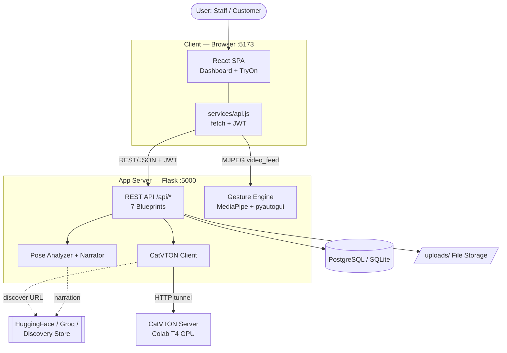

---

## 2. Deployment Diagram

### Nodes / hardware
- **Client Device** (Desktop / Kiosk) — Chrome browser + webcam.
- **App Server** — Python 3.10, Flask, gesture engine thread, Vite (dev).
- **Database Server** — PostgreSQL 15.
- **GPU Node** — Colab T4, PyTorch + CUDA, CatVTON, exposed via tunnel URL.
- **File Storage** — `uploads/` on the app server disk.

### Protocols
HTTP/HTTPS REST (JSON + JWT) · MJPEG `multipart/x-mixed-replace` · HTTP tunnel to GPU.

### Hosting options
Local dev (current) · App → Render/Railway · DB → Supabase/managed Postgres ·
Frontend → Vercel · GPU → Colab / any CUDA host.

### Mermaid
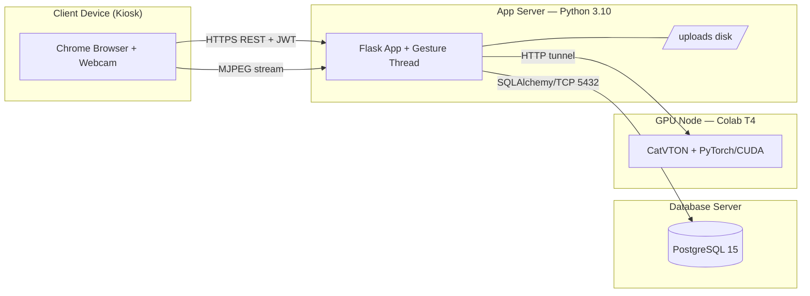

---

## 3. Package Diagram

```
Frontend (src/)
├── components/   Header, Hero, Features, Pricing, FAQ, CTA, Footer,
│                 Metrics, Testimonial, ValueProp, ProtectedRoute
├── layouts/      DashboardLayout
├── pages/        Home, Login, Register, ForgotPassword, ResetPassword, TryOn
│   └── dashboard/  DashboardHome, Inventory, Sessions, Analytics,
│                   Subscription, Settings, Profile
└── services/     api.js  (authAPI, outletsAPI, productsAPI,
                           subscriptionsAPI, sessionsAPI, gesturesAPI, tryonAPI)

Backend (backend/app/)
├── routes/   auth, outlets, products, subscriptions, sessions, gestures, tryon
├── models/   outlet, product, session, subscription, password_reset
└── utils/    gesture_engine, pose_analyzer, narrator,
              tryon_engine, catvton_engine, hand_tracking
```

**Dependencies:** pages → `services/api.js` → Flask `routes/*` → `models/*` → db.
`routes/tryon` → `utils/{catvton_engine, gesture_engine, pose_analyzer, narrator}`.
`routes/gestures` → `utils/gesture_engine`. `ProtectedRoute` → `authAPI`.

### Mermaid
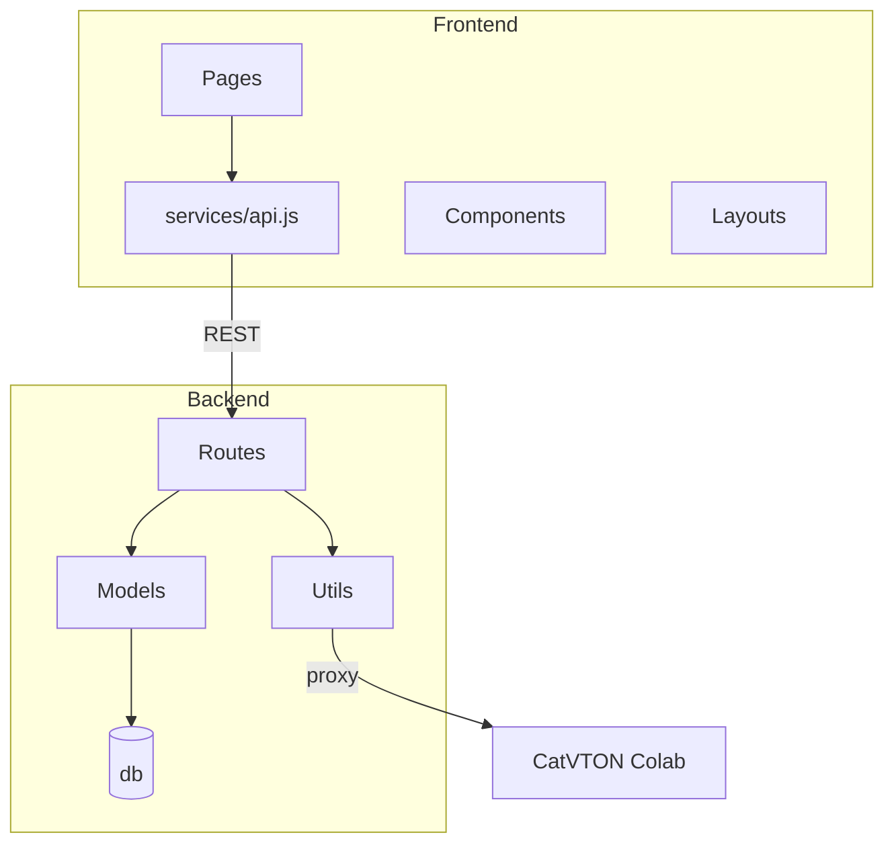

---

## 4. Class Diagram

### Visibility key
`-` private attribute · `+` public method.

### Classes (models)

**Outlet** — table `outlets`
- `-id, -name, -email, -password_hash, -location, -api_key, -is_active, -created_at`
- `+to_dict()`

**Product** — table `products`
- `-id, -outlet_id, -name, -category, -price, -stock_status, -clothing_type,`
  `-image_url, -back_image_url, -additional_images, -segmentation_mask_path,`
  `-segmentation_ready, -created_at, -updated_at`
- `+to_dict()`

**TryOnSession** — table `try_on_sessions`
- `-id, -outlet_id, -kiosk_id, -started_at, -ended_at, -duration_seconds,`
  `-status, -products_tried_count`
- `+end_session(status), +to_dict()`

**TryOnEvent** — table `try_on_events`
- `-id, -session_id, -product_id, -product_name, -product_category,`
  `-product_type, -tried_at, -duration_seconds`
- `+to_dict()`

**Subscription** — table `subscriptions`
- `-id, -outlet_id, -plan_name, -plan_price, -billing_cycle, -status,`
  `-trial_ends_at, -started_at, -current_period_start, -current_period_end,`
  `-cancelled_at, -default_payment_method_id`
- `+is_trial_active(), +is_subscription_active(), +get_days_remaining(),`
  `+get_product_limit(), +create_trial(), +to_dict()`

**PaymentMethod** — table `payment_methods`
- `-id, -subscription_id, -card_brand, -card_last4, -card_expiry,`
  `-card_holder_name, -is_default, -created_at`
- `+to_dict()`

**Invoice** — table `invoices`
- `-id, -subscription_id, -outlet_id, -invoice_number, -amount, -currency,`
  `-status, -created_at, -paid_at, -description, -voucher_code, -discount_amount`
- `+to_dict()`

**Voucher** — table `vouchers`
- `-id, -code, -discount_type, -discount_value, -applicable_plans, -is_active,`
  `-valid_from, -valid_until, -max_uses, -times_used, -created_at`
- `+is_valid(plan), +calculate_discount(amount), +to_dict()`

**PasswordResetToken** — table `password_reset_tokens`
- `-id, -outlet_id, -token, -expires_at, -used, -created_at`
- `+generate_token(), +verify_token(), +mark_used()`

### Engine / utility classes (not persisted)
- **GestureEngine** — `+start(), +stop(), +get_frame(), +get_frame_raw(), -is_running`
- **PoseAnalyzer** — `+analyze_frame(frame, step, selected_upper, selected_lower)`
- **Narrator** — `+get_instruction(step)`
- **CatVTONEngine** — `+set_url(), +set_discovery_url(), +discover(),`
  `+is_configured(), +health(), +resolve_image_to_b64(), +tryon_multiview()`

### Relationships & multiplicity
- Outlet **1 — \*** Product (composition, cascade delete)
- Outlet **1 — \*** TryOnSession (composition)
- Outlet **1 — 1** Subscription
- Outlet **1 — \*** Invoice
- Outlet **1 — \*** PasswordResetToken
- TryOnSession **1 — \*** TryOnEvent (composition)
- TryOnEvent **\* — 0..1** Product (association, nullable snapshot)
- Subscription **1 — \*** PaymentMethod (composition)
- Subscription **1 — \*** Invoice (composition)
- Voucher **\* — \*** Invoice (association via `voucher_code`)

### Mermaid
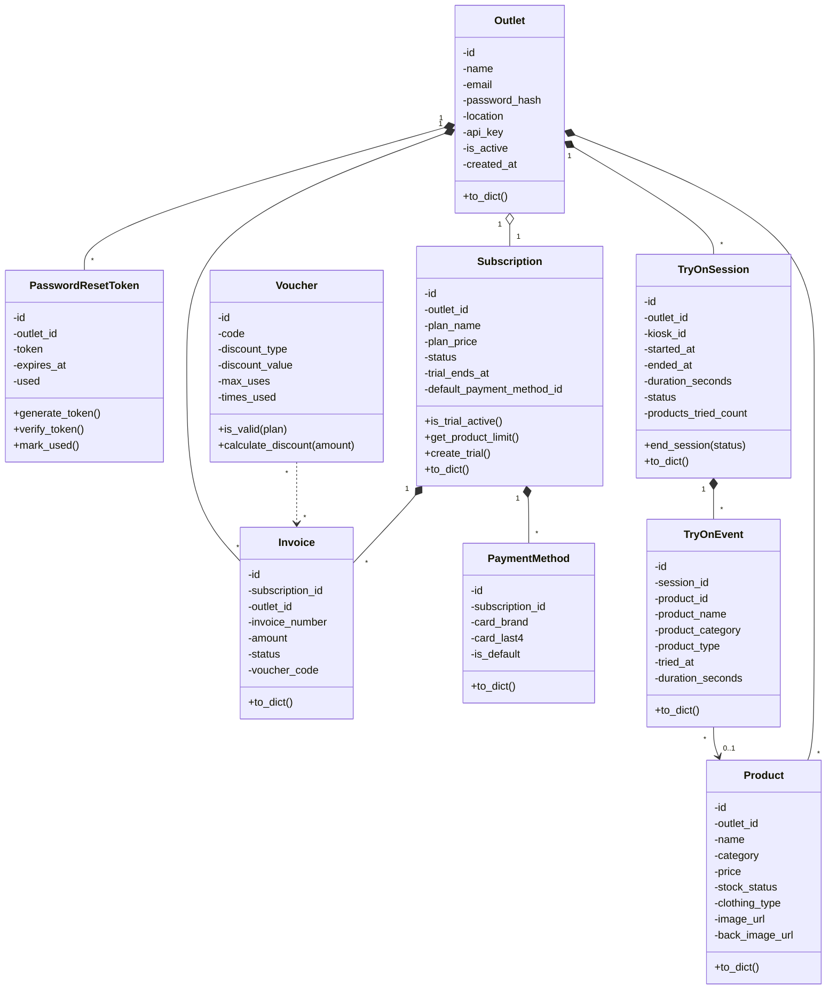

---

## 5. Sequence Diagrams

### 5.1 User Login
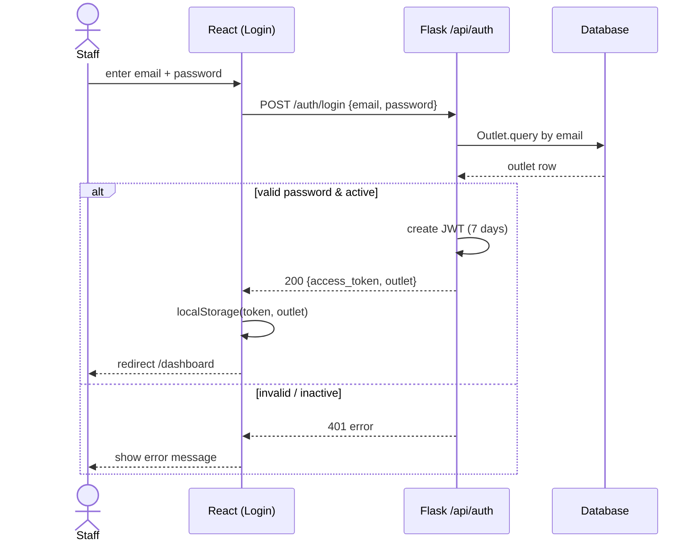

### 5.2 Register Outlet
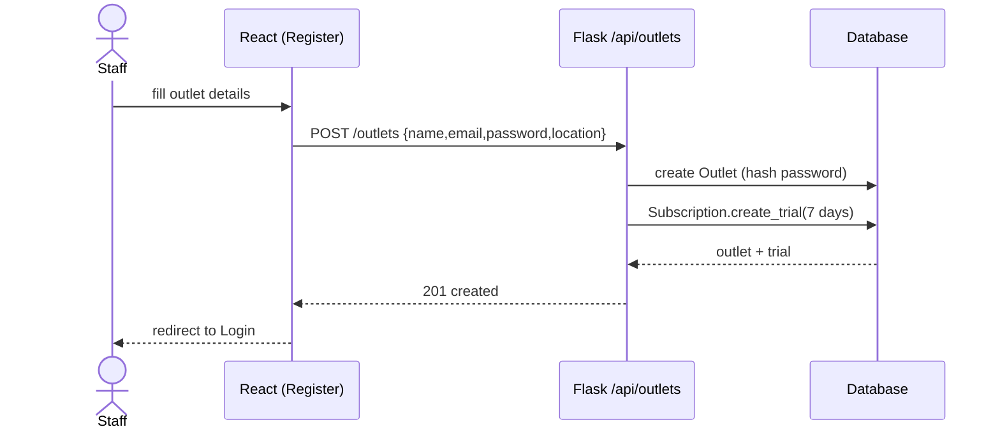

### 5.3 Add Product (with subscription limit check)
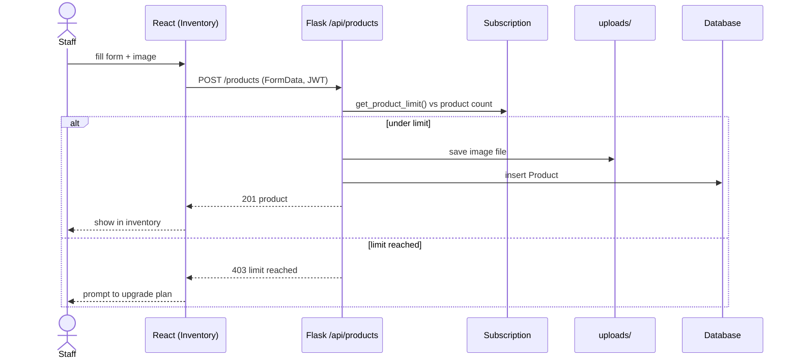

### 5.4 Subscription Payment (select → voucher → pay)
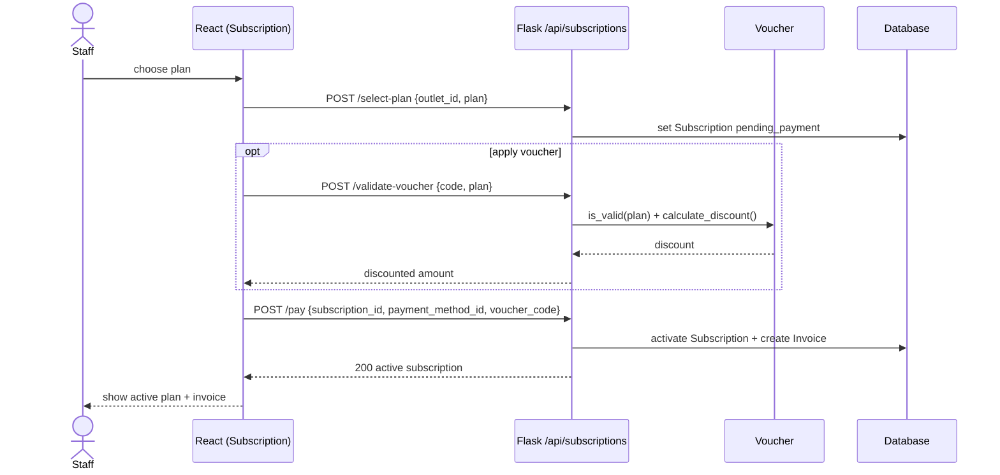

### 5.5 Launch Gesture-Controlled Screen
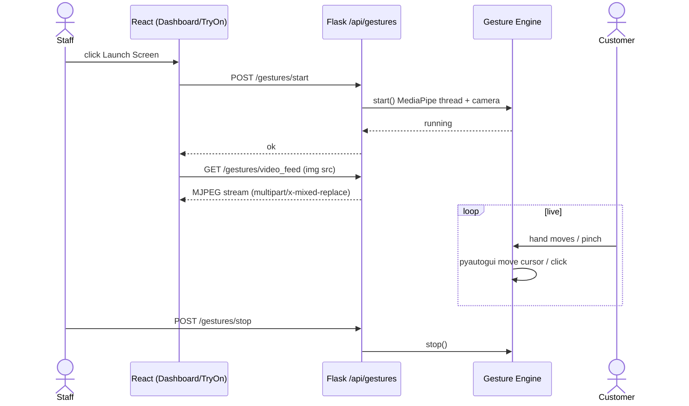

### 5.6 360° Virtual Try-On (CatVTON multi-view)
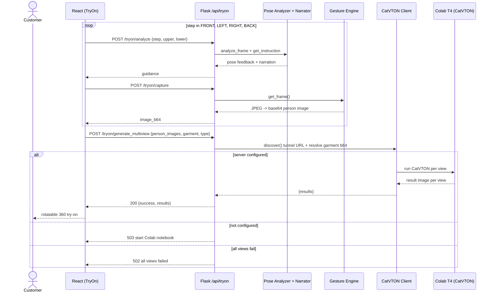

### 5.7 Logout
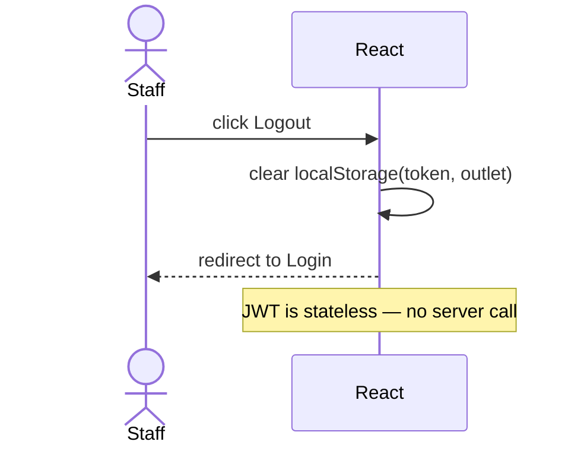

### Alternative / error flows (all use cases)
- Invalid login → 401 · Inactive outlet → 401
- Duplicate email on register → conflict
- Product over plan limit → 403
- Invalid/expired voucher → reject
- Try-on server not configured → 503 · all views fail → 502
- No camera frame → 400/500 · camera busy → 500
- Expired/used reset token → 400

---

## 6. Diagram Build Order
1. Architecture → 2. Deployment → 3. Package → 4. Class → 5. Sequence (one per use case).

## 7. How to render
- Paste any ` ```mermaid ` block into **https://mermaid.live** → export PNG/SVG.
- Or open this file in VS Code with the *Markdown Preview Mermaid* extension.
- For draw.io: Extras → Edit Diagram, or use the Mermaid import.
